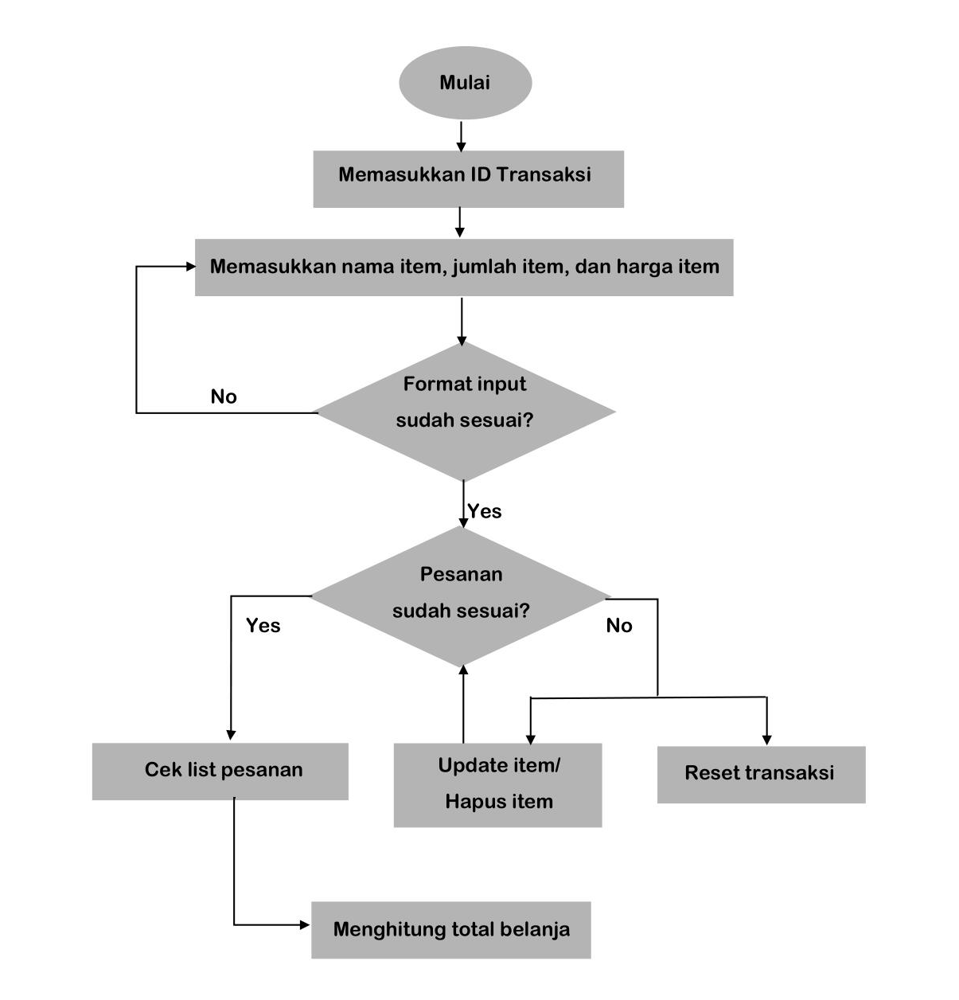

# Project Python: Super Cashier
## Background
Super Cashier adalah sistem kasir self-service untuk sebuah supermarket. 
Customer bisa langsung melakukan transaksinya sendiri dengan memasukkan ID transaksi. Selanjutnya, customer bisa memasukkan item, jumlah item, dan harga item yang ingin dibeli.
## Objektif
Objektif yang harus dipenuhi antara lain:
1. Customer dapat membuat ID transaksinya
2. Customer dapat memasukan nama, jumlah dan harga barang
3. Customer dapat melakukan perubahan nama, jumlah dan harga barang
4. Customer dapat membatalkan/menghapus salah satu item yang akan dibeli dan juga dapat menghapus semua pesanan dengan fitur reset transaction
5. Customer dapat melakukan pengecekan total orderan secara keseluruhan
6. Customer dapat menghitung total belanja yang akan dibeli dengan diskon yang sudah ditetapkan oleh toko, dengan rincian:
   - Jika total belanja di atas Rp200.000, akan mendapatkan diskon 5%.
   - Jika total belanja di atas Rp300.000, akan mendapatkan diskon 8%.
   - Jika total belanja di atas Rp500.000, akan mendapatkan diskon 10%.
## Flowchart

## Penjelasan Program
1. Menginisialisasi `class Transaction` untuk menampung dictionary
```
class Transaction:
    def __init__(self):
        self.list_item = {}
        self.input = True
```
2. Membuat method `add_item()` untuk menyimpan name, quantity, dan price ke dictionary
```
def add_item(self, name, qty, price):
        dict_add = {name: [qty, price]}
        self.list_item.update(dict_add)
        print(f"Item yang dibeli adalah: {self.list_item}.")
```
3. Membuat fungsi update nama, update jumlah, update harga dari item
```
def update_item_name(self, name, new_name):
        input_name = self.list_item[name]
        self.list_item.pop(name)
        self.list_item.update({new_name: input_name})
        print(self.list_item)
 ```
 ```
    def update_item_qty(self, name, new_qty):    
        if type(new_qty)!=int:
            print("Jumlah barang harus berupa angka!")
        else:
            self.list_item[name][0] = new_qty
            print(self.list_item)
```    
```
    def update_item_price(self, name, new_price):       
        if type(new_price)!=int:
            print("Harga barang harus berupa angka!")
        else:
            self.list_item[name][1] = new_price
            print(self.list_item)
```
4. Membuat method `delete_item()` untuk menghapus item dari pesanan
```
def delete_item(self, name):
        try:
            self.list_item.pop(name)
            print(f"Menghapus pesanan {name}.")
            print(self.list_item)
        except KeyError:
            print(f"{name} tidak ada dalam daftar pesanan.")
```
5. Membuat method `reset_transaction()` untuk menghapus semua item
```
def reset_transaction(self):
        self.list_item = self.list_item.clear
        print("Semua item berhasil dihapus.")
```
6. Membuat fungsi `print_item()` untuk mengecek pesanan
```
def print_item(self):
        try:
            table_item = pd.DataFrame(self.list_item).T
            headers = ["Nama Item", "Jumlah Item", "Harga/Item", "Total Harga"]
            print(tabulate(table_item, headers, tablefmt="github"))
        except:
            print("Belum ada pemesanan.")
```
7. Membuat method `total_price` untuk menghitung total belanja
```
def total_price(self):
        self.print_item()
        total_belanja = 0
        for item in self.list_item:
            total_belanja += self.list_item[item][1] 

        if total_belanja>500_000:
            diskon = int(total_belanja*0.1)
            total_belanja = int(total_belanja-diskon)
            print(f"Selamat, Anda mendapatkan diskon 10% sebesar Rp {diskon}.")        
            print(f"Total belanja Anda adalah Rp {total_belanja}.")

        elif total_belanja>300_000:
            diskon = int(total_belanja*0.08)
            total_belanja = int(total_belanja-diskon)
            print(f"Selamat, Anda mendapatkan diskon 10% sebesar Rp {diskon}.")        
            print(f"Total belanja Anda adalah Rp {total_belanja}.")

        elif total_belanja>200_000:
            diskon = int(total_belanja*0.05)
            total_belanja = int(total_belanja-diskon)
            print(f"Selamat, Anda mendapatkan diskon 10% sebesar Rp {diskon}.")        
            print(f"Total belanja Anda adalah Rp {total_belanja}.")

        else:
            print(f"Total belanja Anda adalah Rp {total_belanja}.")
```
## Test Code
### Tes Case 1
Menambahkan item ke pesanan menggunakan method `add.item()`
```
trnsct_123 = c.Transaction()
trnsct_123.add_item("Ayam", 2, 20_000)
trnsct_123.add_item("Pasta Gigi", 3, 15_000)
trnsct_123.add_item("Mie goreng", 4, 12_000)
```
Output :
```
Item yang dibeli adalah: {'Ayam': [2, 20000], 'Pasta Gigi': [3, 15000], 'Mie goreng': [4, 12000]}.
```
### Tes Case 2
Mengupdate item
```
trnsct_123.update_item_name("Pasta Gigi", "Telur")
trnsct_123.update_item_qty("Ayam", 1)
trnsct_123.update_item_price("Mie goreng", 15_000)
```
Output :
```
{'Ayam': [2, 20000], 'Mie goreng': [4, 12000], 'Telur': [3, 15000]}
{'Ayam': [1, 20000], 'Mie goreng': [4, 12000], 'Telur': [3, 15000]}
{'Ayam': [1, 20000], 'Mie goreng': [4, 15000], 'Telur': [3, 15000]}
```
### Tes Case 3
Menghapus item dengan method `delete_item()`
```
trnsct_123.delete_item("Telur")
```
Output :
```
Menghapus pesanan Telur.
{'Ayam': [1, 20000], 'Mie goreng': [4, 15000]}
```
### Tes Case 4
Menghapus semua item dengan method `reset_transaction()`
```
trnsct_123.reset_transaction()
```
Output :
```
Semua item berhasil dihapus.
```
### Tes Case 5
Mengecek seluruh belanjaan dengan `print_item()`
```
trnsct_123.print_item()
```
Output :
```
| Nama Item     |   Jumlah Item |   Harga/Item |
|---------------|---------------|--------------|
| Ayam          |             2 |        20000 |
| Pasta Gigi    |             3 |        15000 |
| Mie goreng    |             4 |        12000 |
| Telur         |            12 |        25000 |
| Ikan          |             5 |        20000 |
| Beras         |             1 |        60000 |
| Minyak goreng |             2 |        50000 |
| Sabun mandi   |             4 |        20000 |
```
### Tes Case 6
Menghitung total belanja dengan method `total_price()`
```
trnsct_123.total_price()
```
Output :
```
| Nama Item     |   Jumlah Item |   Harga/Item |
|---------------|---------------|--------------|
| Ayam          |             2 |        20000 |
| Pasta Gigi    |             3 |        15000 |
| Mie goreng    |             4 |        12000 |
| Telur         |            12 |        25000 |
| Ikan          |             5 |        20000 |
| Beras         |             1 |        60000 |
| Minyak goreng |             2 |        50000 |
| Sabun mandi   |             4 |        20000 |
Selamat, Anda mendapatkan diskon 10% sebesar Rp 11100.
Total belanja Anda adalah Rp 210900.
```
## Kesimpulan
Program Super Cashier ini sesuai dengan objektif yang diinginkan. Selanjutnya, program ini masih bisa dikembangkan lagi. Kedepannya juga mungkin bisa dibuat semacam GUI sehingga penerapannya bisa tampak nyata.
